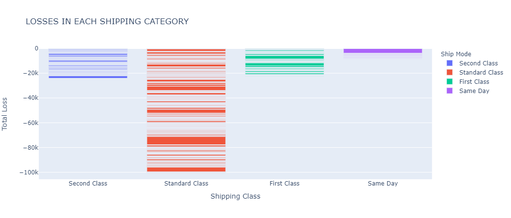

<h1>Task 3 - Exploratory Data Analysis (Retail)</h1>

Task-3 This task is given by The Sparks Foundation in <b>Graduate Rotational Internship Program</b>.

<h2>Exploratory Data Analysis</h2>

<blockquote>
<b>Task 3</b> : In this task, I'll be performing some exploratory data analysis on the 'sample superstore data'.

<h4>Task objectives</h4>The following are the task objectives :
<ul>
<li>Performing EDA on the data to derive insights on how the profits can be increased.</li>
<li>Discovering the weak areas of the sales deparment in order to improve the sales.</li>
<li>Discovering hidden trends within the data that will allow the sales deparment to cater to region-specific needs of the buyers.</li>
</ul></blockquote> 

<blockquote>Dataset consists of only 13 variables:
            <ol>
                <li><b>Ship Mode</b> : Mode of shipping used for shipment delivery</li>	
                <li><b>Segment</b> : Customer segment product was shipped to</li>	
                <li><b>Country</b> : Country in which the shipment was delivered</li>	
                <li><b>City</b> : City in which shipment was delivered</li>	
                <li><b>State</b> : State in which the shipment was delivered</li>	
                <li><b>Postal Code</b> : Postal code the shipment was delivered to</li> 	
                <li><b>Region</b> : Country region</li>	
                <li><b>Category</b> : The category product belongs to</li>	
                <li><b>Sub-Category</b> : Sub-category of the product</li>	
                <li><b>Sales</b> : Sale made in USD</li>	
                <li><b>Quantity</b> : Quantity of product sold</li>	
                <li><b>Discount</b> : Discount given on product</li>	
                <li><b>Profit</b> : Profit earned on product sold</li>
            </ol>
</blockquote>

---

 

 

 

The observations from the above plots are:
<blockquote><ul>
<li>For the '<b>Ship Mode</b>' categorical feature, most of the data is accupied by '<b>Stadard Class</b>' category which is <b>5968</b>, while least of the data is accupied by '<b>Same Day</b>' category which is <b>543</b>.</li>
<li>For the '<b>Segment</b>' categorical feature, most of the data is accupied by '<b>Consumer</b>' category which is <b>5191</b>, while least of the data is accupied by '<b>Home Office</b>' category which is <b>1783</b>.</li>
<li>For the '<b>Region</b>' categorical feature, most of the data is accupied by '<b>West</b>' category which is <b>3203</b>, while least of the data is accupied by '<b>South</b>' category which is <b>1620</b>.</li>
<li>For the '<b>Category</b>' categorical feature, most of the data is accupied by '<b>Office Supplies</b>' category which is <b>6026</b>, while least of the data is accupied by '<b>Technology</b>' category which is <b>1847</b>.</li>
</ul>
</blockquote>

The observations from the above plot are:
<blockquote><ul>
<li>For the '<b>Sub-Category</b>' categorical feature, most of the data is accupied by '<b>Binders</b>' category which is <b>1523</b>, while least of the data is accupied by '<b>Copies</b>' category which is <b>68</b>.</li>
</ul>
</blockquote>

---

Observations from the plot above-
<blockquote><ul>
    <li>Around <b>50%</b> of the total <code>'sales'</code> were made in the <b>consumer segment</b> which comprises of the individual buyers.</li>
    <li>The <b>Corporate sector and Home Office segments</b> have around <b>31%</b> and <b>19%</b> <code>'sales'</code> respectively.</li>
</ul></blockquote>

---

Now, let us analyze what percent of profits does each customer section makes for the supermarket.
 
Some interesting observations here.
<blockquote><ul>
    <li>While the <b>Consumer segment</b> had <b>more than 50%</b> in <b>sales</b>, its total contribution in the <b>profits</b> made by the company is <b>only around 46%</b>. This shows that the company is bearing a higher loss in the Consumer segment.</li>
    <li>The <b>Corporate and the Home Office segments</b> are returning more profits to the supermarket as compared to the sales made. While their <b>joint sales is around 50%</b>, thier <b>joint profits</b> made for the supermarket is <b>around 54%</b>.</li>
</ul></blockquote>
Here, the company can do two things in order to increase their profits. They can look into the reasons why they are bearing more losses in the consumer segment and try to reduce those losses, thus directly increasing the sales. 
Other route the company can take is to providing more polished services to the Corporate and Home Office segments, thus driving them towards more profits.

---

Observations from the above given geographical plot-
<blockquote>
<ul>
<li>The company has <b>the highest sales</b> in the state of <b>California</b> (shown in dark maroon), selling around <b>USD 450K</b> of goods.</li>
<li><b>New York</b> (bright red, top right) is the state with <b>the second highest sales</b>, with more that <b>USD 300k</b> worth of goods sold.</li>
<li>The states of <b>Texas</b> (bottommost, orange) and <b>Washington</b> (top left, orange) end up <b>third and fourth on the top</b> sales charts with around <b>USD 170K</b> and <b>USD 140K</b> in sales respectively.</li>
<li>If we look at the overall data, we will observe that the supermarket company does most of its business in East Coast and West Coast region. <b>In fact, the total sales in the state of New York is more than the sales in all of the Central America combined</b>.</li>
</ul>
</blockquote>

---

The observations from the above plot are:
<blockquote><ul>
<li>The states in shades of green, namely <b>New York, California and Washington</b> are the most profitable for the company, with <b>profits of over USD 30K</b>.</li>
<li>The states in teal and blue, with an average profit of around USD 25K are mostly situated in the north-east and south-east region.</li>
<li>The state of Texas, with the third highest sales proved to be the most expensive state for the company with a very high loss of around USD 25K.</li>
</ul>
</blockquote>

---

<h4>Now, let us have a look at the profit to sales ratio of each state. The profit-to-sales ratio tells us how much the store has to sell in that state in order to make profit.</h4>
<blockquote><UL>
<li>The higher the profit-to-sales ratio, the more profit returns the store gets in the state for each sale they make.</li>
<li>A lower ratio denotes that the store has to make a lot more sales in order to make the same amount of profit as compared to a state with a higher profit-to-sales ratio.</li>
<li>States with a negative profit-to-sales ratio denote a higher loss on each sale they make.</li>
</UL></blockquote>
These insights can help the supermarket in determining which state needs more attention as compared to the others. 

Some interesting observations here:
<blockquote><UL>
<li>Ohio has the worst profit-to-sales ratio in terms of total sales and the losses beared.</li>
<li>Delaware has the highest profit-to-sales ratio.</li>
<li><b>The states making the largest profits for the company, namely New York, California and Washington DC don't have the highest profit-to-sales ratio. This means that the company can further improve its sales/profits in these states.</b></li>
</UL></blockquote>

---

<h4>Profit per Category - Sub Category</h4>
Let us have a look at the performance of each sub category.

From the above given plots, it is clear that-
<blockquote><ul>
<li>'Tables' and 'Bookcases' are the businesses where the company is losing most of its money.</li>
<li>While the technology business is making most of the profits for the company, the machines business makes the least profit. The superstore can improve in that sub-category.</li>
<li>Considering the combined turnover from each category, the furniture business is where the company is barely making any considerable profit. May be the shipping modes and shipping costs for the furniture products, which are usually large, has something to do with the low profits/high losses.</li>
</ul></blockquote>

---

<h4>Let us have a look at what role the various shipping modes has to play in all this.</h4> 

First, let us have a look at which shipping method different consumer segments use the most for buying products in different product categories.

Observations from the above given plot-

<blockquote><ul>
<li>Standard class shipping is the most used shipping method across all consumer segments and product categories.</li>
<li>Across all three consumer segments, office supplies are the most bought products, and the technology items are the least bought products.</li>
</ul></blockquote>

---

Now, let us consider <h4>how much loss each shipping category bears</h4>

Observations from the plot above-
<blockquote><ul>
<li>The <b>highest loss</b> beared by the company was while delivering products via the <b>standard class shipping</b>. This is of no surprise, since most products were delivered using standard shipping. However, one important thing to be noted is that some of the biggest losses beared by the superstore also fall under the standard shipping category, one going <b>as high as USD 6,600 in a single sale</b>.</li>
<li>First and second class shipping have almost equal losses. This is also no surprise since the number of sales shipped under each shipping category were also almost equal.</li>
</ul></blockquote>
Apart from this information, it doesn't seem that shipping has a major effect on profits or losses as such.

---

<h4>Now, for the last part of our EDA section, we will see how discounts affect the sale of products and the revenue generated by it.</h4>

Observations from the above given plots-
<blockquote><ul>
<li>Considering both average and total sales, it seems that <b>people tend to buy more things when it is selling at a discounted price</b>. <b>An average sale at discounted price</b> is of around <b>USD 232</b> as compared to <b>USD 226 on undiscounted price</b>.</li>
<li>On an average, a <b>discounted sale results in a loss of around USD 6</b> as compared to around <b>USD 66 in profit on a non-discounted sale</b>. Also, the company made a total <b>profit of around USD 320K on non-discount sales</b>, as compared to a <b>loss of around USD 34K on discounted sales</b>.</li>
<li>The <b>average price of a discounted</b> product is around <b>USD 62</b>, while the same is around <b>USD 58 for a non-discounted</b> item.</li>
</ul></blockquote>

---

<h2>Conclusion:</h2>

One thing to be noted is that while the superstore is incurring losses due to giving discounts on its products, they can't stop giving discounts of their products. Most of the heavy discounts are during festivals, end-of-season and clearance sales which are necessary so that the store can make space in their warehouses for fresh stock. Also, by incurring small losses, the company gains in the future by attracting more long term customers. Therefore, the small losses from discounts are an essential part of company's business.
